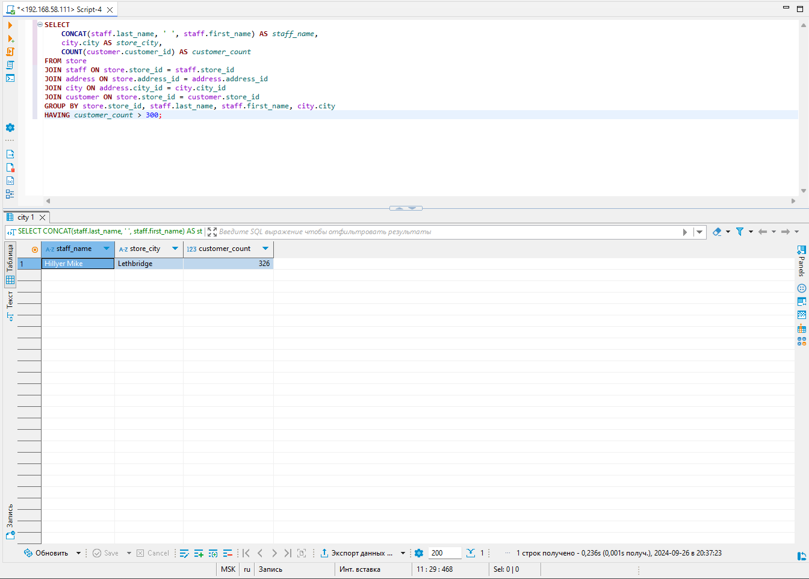
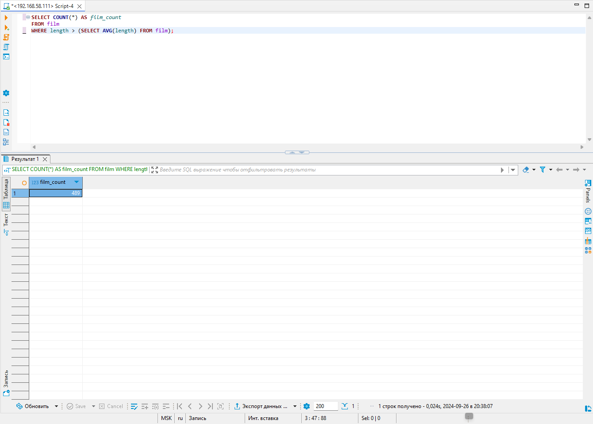
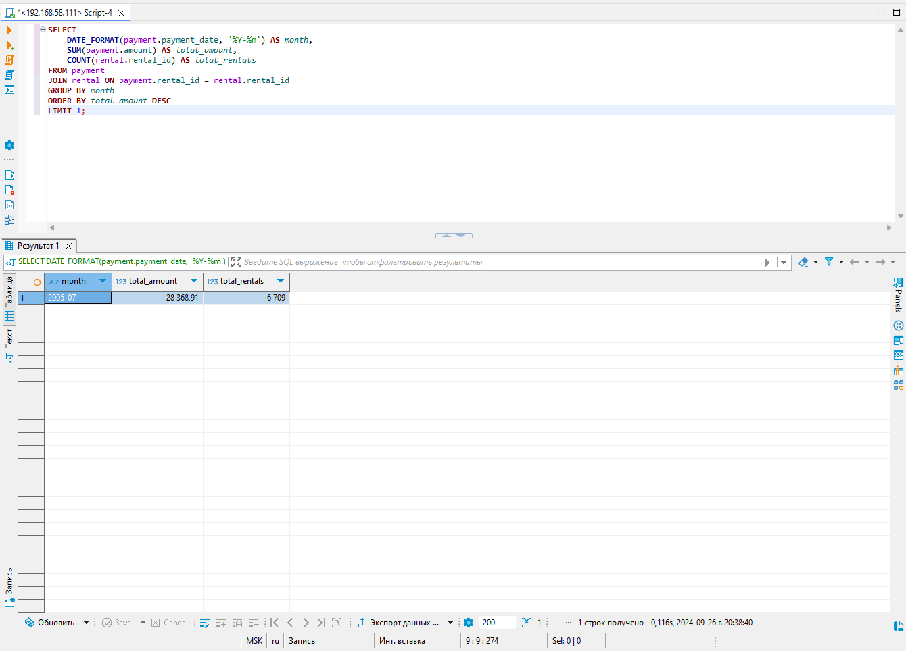
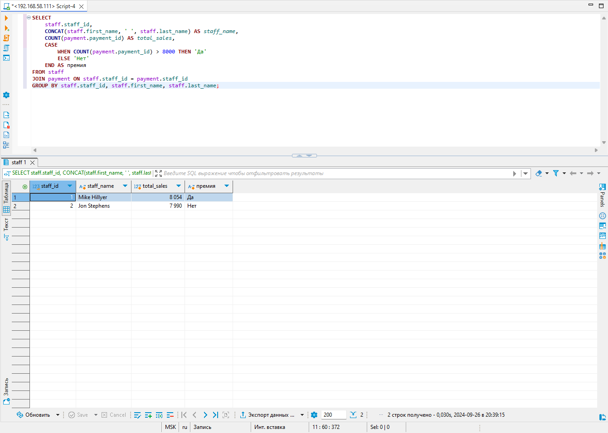
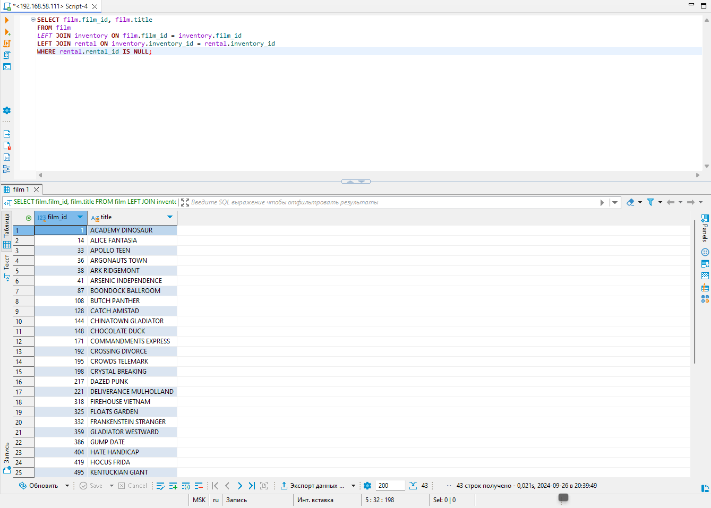

# Домашнее задание к занятию "`SQL. Часть 1`" - `Дедюрин Денис`

---
## Задание 1
Одним запросом получите информацию о магазине, в котором обслуживается более 300 покупателей, и выведите в результат следующую информацию:

фамилия и имя сотрудника из этого магазина;
город нахождения магазина;
количество пользователей, закреплённых в этом магазине.

### Ответ:
```
SELECT 
    CONCAT(staff.last_name, ' ', staff.first_name) AS staff_name,
    city.city AS store_city,
    COUNT(customer.customer_id) AS customer_count
FROM store
JOIN staff ON store.store_id = staff.store_id
JOIN address ON store.address_id = address.address_id
JOIN city ON address.city_id = city.city_id
JOIN customer ON store.store_id = customer.store_id
GROUP BY store.store_id, staff.last_name, staff.first_name, city.city
HAVING customer_count > 300;
```


---
## Задание 2
Получите количество фильмов, продолжительность которых больше средней продолжительности всех фильмов.

### Ответ:
```
SELECT COUNT(*) AS film_count
FROM film
WHERE length > (SELECT AVG(length) FROM film);
```


---
## Задание 3
Получите информацию, за какой месяц была получена наибольшая сумма платежей, и добавьте информацию по количеству аренд за этот месяц.

### Ответ:
```
SELECT 
    DATE_FORMAT(payment.payment_date, '%Y-%m') AS month,
    SUM(payment.amount) AS total_amount,
    COUNT(rental.rental_id) AS total_rentals
FROM payment
JOIN rental ON payment.rental_id = rental.rental_id
GROUP BY month
ORDER BY total_amount DESC
LIMIT 1;
```


---
## Задание 4*
Посчитайте количество продаж, выполненных каждым продавцом. Добавьте вычисляемую колонку «Премия». Если количество продаж превышает 8000, то значение в колонке будет «Да», иначе должно быть значение «Нет».

### Ответ:
```
SELECT 
    staff.staff_id,
    CONCAT(staff.first_name, ' ', staff.last_name) AS staff_name,
    COUNT(payment.payment_id) AS total_sales,
    CASE
        WHEN COUNT(payment.payment_id) > 8000 THEN 'Да'
        ELSE 'Нет'
    END AS премия
FROM staff
JOIN payment ON staff.staff_id = payment.staff_id
GROUP BY staff.staff_id, staff.first_name, staff.last_name;
```


---
## Задание 5*
Найдите фильмы, которые ни разу не брали в аренду.

### Ответ:
```
SELECT film.film_id, film.title
FROM film
LEFT JOIN inventory ON film.film_id = inventory.film_id
LEFT JOIN rental ON inventory.inventory_id = rental.inventory_id
WHERE rental.rental_id IS NULL;
```


